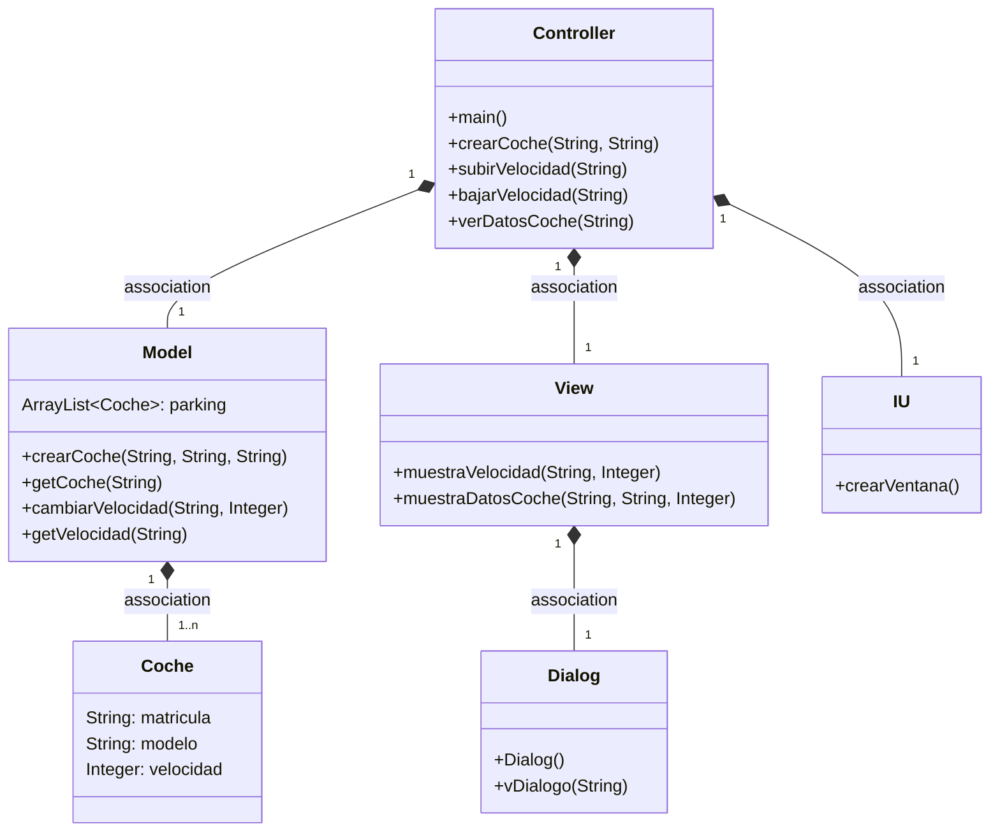
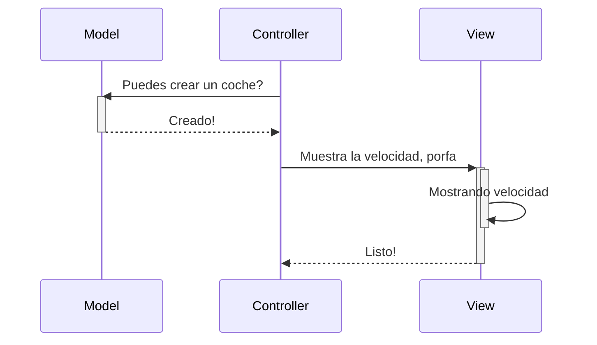
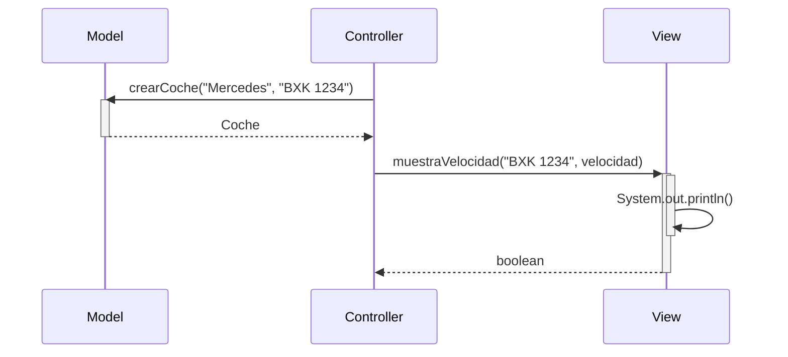

# Arquitectura MVC

Aplicación que trabaja con objetos coches, modifica la velocidad y la muestra. 
Además, permite buscar un coche que ya esté registrado para poder ver todos sus datos, siendo estos el modelo, la matrícula y la velocidad.

---
## Diagrama de clases:

---

## Diagrama de Secuencia

Ejemplo básico del procedimiento, sin utilizar los nombres de los métodos

El mismo diagrama con los nombres de los métodos

